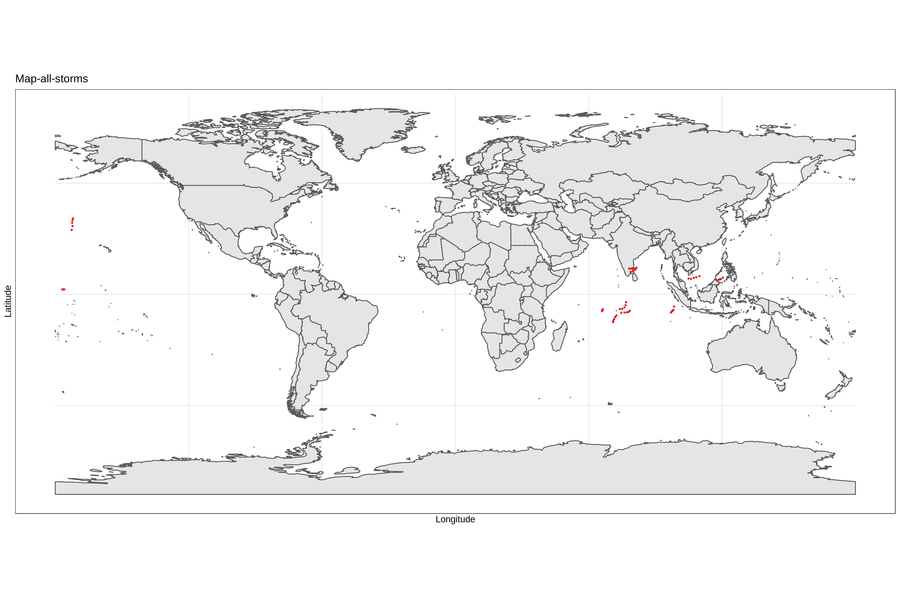
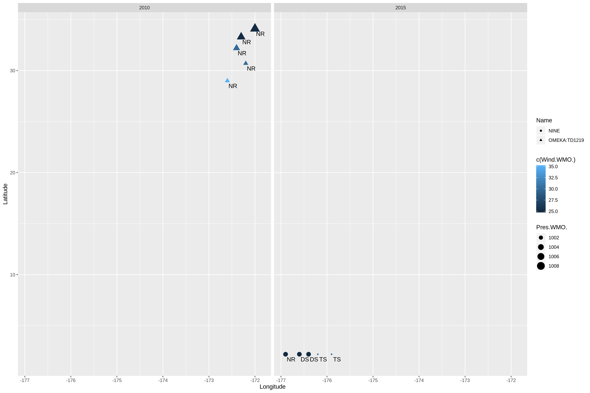

```{r,include=FALSE}
library(lubridate)
library(dplyr)
library(readr)
library(ggplot2)
library(sf)
library(rnaturalearth)
library(rnaturalearthdata)

dat <- read.csv(
file = "~/Desktop/workouts/workout1/data/ibtracs-2010-2015.csv", 
na.strings = c("-999.","-1.0", "0.0"), 
sep = ",", 
fill = TRUE, 
header = TRUE, 
colClasses = c("character", "integer", "character", "character", "character", "character", "character", "character","real", "real", "real", "real"))

```


### Report of storms from 2010 to 2015

This graph depict the trajectories of all storms. The storms are marked as red dot. In this map we can see most sotrms are concentrated near the equator.  
```{r echo=FALSE, fig.align='center'}


```
This graph is the visualization of the storms in basins EP and NA, facetted by year. To distinguish each characteristics of a certain storm. I mark the "Nature" by label, "Wind" by color, "Pres" by size, "Name" by shape. Mostly, the "NR" storms have highrt Latitude compared with other kinds of storms. 
```{r echo=FALSE, fig.align='center'}



```


In order to deeply analysis the storms in 2010 to 2015. I wirte the report by answering the following question. 
1.What is the number of (unique) storms in each year?
To count the number of storms in each year. I use the function group_by and then count the storms in each certain year. 
```{r}
# the number of (unique) storms in each year
dat %>% group_by(Season) %>% count(Name)
```


2.What is the total number of storms per hemisphere? We filter the storm by different latitude. There are more storms in north hemisphere than south hemisphere, which is 30 compared with 24.
```{r}
# the total number of storms per hemisphere
count(dat %>% filter(Latitude<0))
count(dat %>% filter(Latitude>0))
```

3.Do storms tend to occur uniformly throughout the year (evenly amount of storms per month)? Then I found out most storms had happened during the month 10 to 12. There are most storms had happened at December while least storms in January.
```{r}
count(dat %>% group_by(month(ISO_time)))
```

4.Is there a particular Basin where storms occur more frequently? Then we find out the relationship between storm and basin. There are most storms had happened at basin SI which is 30. And number of storms happened at other basin are the same which are all 10. 
```{r}
# Basin
count(dat %>% group_by(Basin))
```

5.What is the typical duration of a storm? To find out the duration of each storm we use the function *difftime* . Then we can find out storm *THANE* last 15 hours while other storm last 1 days.
```{r}   
Duration <- dat %>% group_by(Name) %>% select(ISO_time)
for (i in list(c(5,1), c(10,6), c(15,11), c(20,16), c(25,21), c(30,26))) {
  print(Duration$Name[i[2]])
  print(difftime(Duration$ISO_time[i[1]], Duration$ISO_time[i[2]]))
}
```

6.What is the top-10 list of storms in terms of high wind speed values? The strom with highest wind speed is 75. 
```{r}
tail(sort(dat$Wind.WMO.), n =10)
```
```