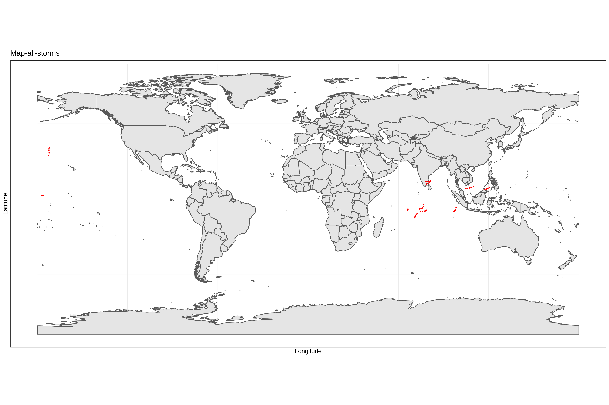
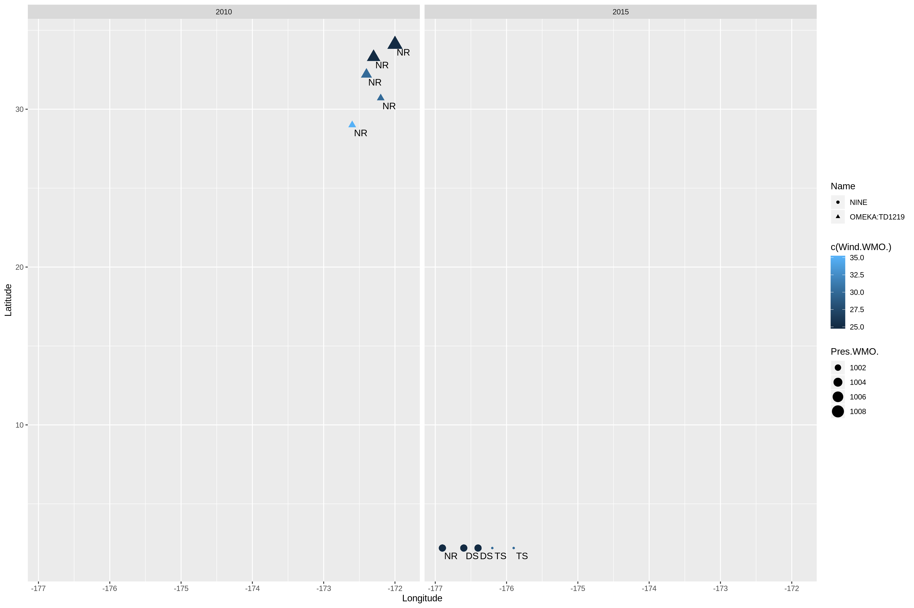

workout1-Zhaoyang-Chen
================
Zhaoyang Chen
10/17/2019

### Report of storms from 2010 to 2015

This graph depict the trajectories of all storms. The storms are marked
as red dot. In this map we can see most sotrms are concentrated near the
equator.  

This graph is the visualization of the storms in basins EP and NA,
facetted by year. To distinguish each characteristics of a certain
storm. I mark the “Nature” by label, “Wind” by color, “Pres” by size,
“Name” by shape. Mostly, the “NR” storms have highrt Latitude compared
with other kinds of storms.


In order to deeply analysis the storms in 2010 to 2015. I wirte the
report by answering the following question. 1.What is the number of
(unique) storms in each year? To count the number of storms in each
year. I use the function group\_by and then count the storms in each
certain year.

``` r
# the number of (unique) storms in each year
dat %>% group_by(Season) %>% count(Name)
```

    ## # A tibble: 12 x 3
    ## # Groups:   Season [6]
    ##    Season Name               n
    ##     <int> <chr>          <int>
    ##  1   2010 ANJA               5
    ##  2   2010 OMEKA:TD1219       5
    ##  3   2011 ONE                5
    ##  4   2011 THANE              5
    ##  5   2012 ALENGA             5
    ##  6   2012 WUKONG             5
    ##  7   2013 ANAIS              5
    ##  8   2013 MADI               5
    ##  9   2014 0120132014:ONE     5
    ## 10   2014 JANGMI             5
    ## 11   2015 ADJALI             5
    ## 12   2015 NINE               5

2.What is the total number of storms per hemisphere? We filter the storm
by different latitude. There are more storms in north hemisphere than
south hemisphere, which is 30 compared with 24.

``` r
# the total number of storms per hemisphere
count(dat %>% filter(Latitude<0))
```

    ## # A tibble: 1 x 1
    ##       n
    ##   <int>
    ## 1    24

``` r
count(dat %>% filter(Latitude>0))
```

    ## # A tibble: 1 x 1
    ##       n
    ##   <int>
    ## 1    30

3.Do storms tend to occur uniformly throughout the year (evenly amount
of storms per month)? Then I found out most storms had happened during
the month 10 to 12. There are most storms had happened at December while
least storms in January.

``` r
count(dat %>% group_by(month(ISO_time)))
```

    ## # A tibble: 4 x 2
    ## # Groups:   month(ISO_time) [4]
    ##   `month(ISO_time)`     n
    ##               <dbl> <int>
    ## 1                 1     6
    ## 2                10    15
    ## 3                11    10
    ## 4                12    29

4.Is there a particular Basin where storms occur more frequently? Then
we find out the relationship between storm and basin. There are most
storms had happened at basin SI which is 30. And number of storms
happened at other basin are the same which are all 10.

``` r
# Basin
count(dat %>% group_by(Basin))
```

    ## # A tibble: 4 x 2
    ## # Groups:   Basin [4]
    ##   Basin     n
    ##   <chr> <int>
    ## 1 " EP"    10
    ## 2 " NI"    10
    ## 3 " SI"    30
    ## 4 " WP"    10

5.What is the typical duration of a storm? To find out the duration of
each storm we use the function *difftime* . Then we can find out storm
*THANE* last 15 hours while other storm last 1
days.

``` r
Duration <- dat %>% group_by(Name) %>% select(ISO_time)
```

    ## Adding missing grouping variables: `Name`

``` r
for (i in list(c(5,1), c(10,6), c(15,11), c(20,16), c(25,21), c(30,26))) {
  print(Duration$Name[i[2]])
  print(difftime(Duration$ISO_time[i[1]], Duration$ISO_time[i[2]]))
}
```

    ## [1] "ANJA"
    ## Time difference of 1 days
    ## [1] "OMEKA:TD1219"
    ## Time difference of 1 days
    ## [1] "ONE"
    ## Time difference of 1 days
    ## [1] "THANE"
    ## Time difference of 15 hours
    ## [1] "ALENGA"
    ## Time difference of 1 days
    ## [1] "WUKONG"
    ## Time difference of 1 days

6.What is the top-10 list of storms in terms of high wind speed values?
The strom with highest wind speed is 75.

``` r
tail(sort(dat$Wind.WMO.), n =10)
```

    ##  [1] 30 30 30 30 30 33 35 55 75 75

\`\`\`
