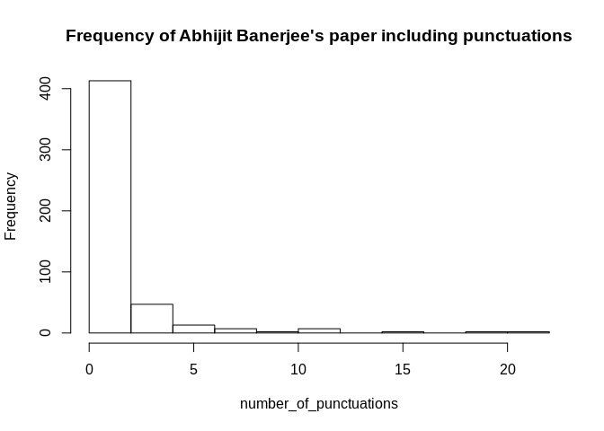
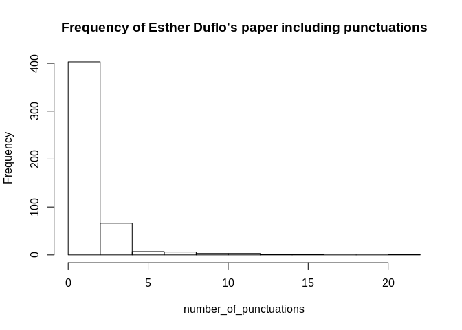
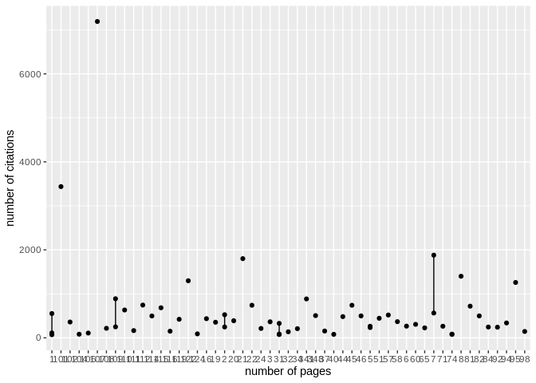

Workout3-Zhaoyang Chen
================
Zhaoyang Chen
12/6/2019

#### required packages

``` r
library(stringr)
library(tidyverse)
library(wordcloud)
library(ggplot2)
library(dplyr)
library(scholar)
```

#### data preparation

``` r
A.B_citations <-as.data.frame(read.csv(file ='/home/chaoyoung/Desktop/workouts/workout3/data/cleandata/A.B_citations.csv'))

E.D_citations <-as.data.frame(read.csv(file ='/home/chaoyoung/Desktop/workouts/workout3/data/cleandata/E.D_citations.csv'))
```

#### Section 1 Practice with Regular Expressions

1)  For the two scholars, how many of their paper titles begin with a
    word that starts with a vowel, respectively?

<!-- end list -->

``` r
temp1 <- str_match(A.B_citations$article_title,"^[aeiou/AEIOU]")
temp1 <- na.omit(temp1)
# number of A.B's papers begin with a Vowel
ans1 <- length(temp1)
ans1
```

    ## [1] 118

``` r
temp2 <- str_match(E.D_citations$article_title,"^[aeiou/AEIOU]")
temp2 <- na.omit(temp2)
# number of A.B's papers begin with a Vowel
ans2 <- length(temp2)
ans2
```

    ## [1] 118

The numbers of this two scholars’ paper titles starting with a vowel are
exactly the same\! amazing\!

2)  For the two scholars, how many of their paper titles end with “s”
    respectively?

<!-- end list -->

``` r
temp1 <- str_match(A.B_citations$article_title,"[s]$")
temp1 <- na.omit(temp1)
# number of A.B's papers end with "s"
ans1 <- length(temp1)
ans1
```

    ## [1] 78

``` r
temp2 <- str_match(E.D_citations$article_title,"[s]$")
temp2 <- na.omit(temp2)
# number of E.D's papers end with "s"
ans2 <- length(temp2)
ans2
```

    ## [1] 74

3)  For the two scholars, find the longest title, respectively
    (“longest” in terms of number of characters).

<!-- end list -->

``` r
# note which.max() will return the index of max number
temp1 <- str_length(A.B_citations$article_title)
ans1 <- A.B_citations$article_title[which.max(temp1)]
# The longest title
ans1
```

    ## [1] Voters be Primed to Choose Better Legislators? Experimental Evidence from Rural India,” October 2010. mimeo, Harvard Universiy. 4, 27, 29, Selvan Kumar, Rohini Pande, and Felix …
    ## 475 Levels: ¿ Cuál es tu evidencia? ...

``` r
temp2 <- str_length(E.D_citations$article_title)
ans2 <- E.D_citations$article_title[which.max(temp2)]
# The longest title
ans2
```

    ## [1] Controlling the costs of HIV/AIDS management--unique management software to empower organisations to formulate and implement strategies best suited for their specific requirements.
    ## 461 Levels: ‘Beating the Odds’ versus ‘Changing the Odds’: Poverty, Resilience, and Family Policy. ...

4)  For the two scholars, calculate the variable “number of punctuation
    symbols in the their titles”. Display summary() statistics of these
    variables, and the corresponding histograms.

<!-- end list -->

``` r
temp1 <- str_count(A.B_citations$article_title, "[[:punct:]]")
summary(temp1)
```

    ##    Min. 1st Qu.  Median    Mean 3rd Qu.    Max. 
    ##    0.00    0.00    1.00    1.64    2.00   21.00

``` r
number_of_punctuations <- temp1
hist(number_of_punctuations, main="Frequency of Abhijit Banerjee's paper including punctuations")
```

<!-- -->

``` r
temp2 <- str_count(E.D_citations$article_title, "[[:punct:]]")
summary(temp2)
```

    ##    Min. 1st Qu.  Median    Mean 3rd Qu.    Max. 
    ##    0.00    0.00    1.00    1.54    2.00   21.00

``` r
number_of_punctuations <- temp2
hist(number_of_punctuations, main="Frequency of Esther Duflo's paper including punctuations")
```

<!-- -->

5)  Remove stop words(“the”, “a”, “an”, “and”, “in”, “if”, “but”),
    numbers and punctua- tions from the
titles.

<!-- end list -->

``` r
# add space " " after each stop words in case that str_remove will remove "if" in some words including "if", such as making "differ" as "dfer".

ans1 <- str_remove_all(A.B_citations$article_title, 
        "[[:punct:]]|[[:digit:]]|The |the |If |if |A |a |An|an |And |and |In |in |But |but ")

ans2 <- str_remove_all(E.D_citations$article_title, 
        "[[:punct:]]|[[:digit:]]|The |the |If |if |A |a |An|an |And |and |In |in |But |but ")
```

6)  Excluding stop words, numbers and punctuations, what are the 10 most
    frequent words in scholar A’s titles and scholar B’s titles?

**In this part, I encountered a problem.** I cannot remove extra
“spaces” from the title. I think there is something wrong with the
original title in the html file. So I returned the first 11 words,
including the meaningless word “space” and I believe my answer is
correct. :)

``` r
# 
# In this part, I will ues the answer from the previous questions!
# use str_split
mytext <- str_split(ans1, "[[:space:]]", simplify = FALSE)
# convert list as vector
mytext <- unlist(mytext, use.names=FALSE)
mytable_1 <- sort(table(mytext), decreasing=T)
# top 10 most frequent words of Abhijit Banerjee's paper 
mytable_1[1:11]
```

    ## mytext
    ##          of                      to        from    Evidence       India 
    ##         172         125          67          66          47          43 
    ##         for          DP Development          on   Economics 
    ##          37          30          25          22          21

``` r
mytext <- str_split(ans2, "[[:space:]]", simplify = FALSE)
# convert list as vector
mytext <- unlist(mytext, use.names=FALSE)
mytable_2 <- sort(table(mytext), decreasing=T)
# top 10 most frequent words of Esther Duflo's paper
mytable_2[1:11]
```

    ## mytext
    ##          of                    from          to    Evidence         for 
    ##         178         102          99          79          74          52 
    ##       India          DP          on  randomized Development 
    ##          49          36          33          33          25

#### Section 2 Data visualizations

**Wordcloud** Actually I think other meanless words also need to be
deleted, such as “of”, “for”, but I still include them in the following
wordcloud.

``` r
A.B_wordcloud_df <- as.data.frame(mytable_1)
A.B_wordcloud_df <- A.B_wordcloud_df[-c(2), ]
set.seed(1234)
png(filename = "/home/chaoyoung/Desktop/workouts/workout3/images/A.B_wordcloud.png")
wordcloud(words = A.B_wordcloud_df$mytext, freq = A.B_wordcloud_df$Freq, min.freq = 1,
          max.words=100, random.order=FALSE, rot.per=0.35, 
          colors=brewer.pal(8, "Dark2"))
dev.off()

E.D_wordcloud_df <- as.data.frame(mytable_2)
E.D_wordcloud_df <- E.D_wordcloud_df[-c(2), ]
png(filename = "/home/chaoyoung/Desktop/workouts/workout3/images/E.D_wordcloud.png")
wordcloud(words = E.D_wordcloud_df$mytext, freq = E.D_wordcloud_df$Freq, min.freq = 1,
          max.words=100, random.order=FALSE, rot.per=0.35, 
          colors=brewer.pal(8, "Dark2"))
dev.off()
```


**Line plot**

``` r
# Citations plot of Abhijit Banerjee
id <- "HLpqZooAAAAJ"
ct <- get_citation_history(id)
png(filename = "/home/chaoyoung/Desktop/workouts/workout3/images/A.B_citations_plot.png")
ggplot(ct, aes(year, cites)) + geom_line() + geom_point()
dev.off()


# Citations plot of Esther Duflo
id <- "yhDMl8AAAAAJ"
ct <- get_citation_history(id)
png(filename = "/home/chaoyoung/Desktop/workouts/workout3/images/E.D_citations_plot.png")
ggplot(ct, aes(year, cites)) + geom_line() + geom_point()
dev.off()
```


**Word of the Year**  
In the top10 words of Abhijit Banerjee’s paper titles, I select the
fowllowing words:  
**Evidence India Economics**  
In the top10 words of Esther Duflo’s paper titles, I select the
fowllowing words:  
**Evidence India
randomized**

``` r
key_words <- unlist(str_extract(A.B_citations$article_title, pattern = "Evidence|India|Economics"), use.names=FALSE)
# make a new data frame representing the key words and year
A.B_word_year <- data.frame("key_words" = key_words, "year" = A.B_citations$year)
A.B_word_year <- na.omit(A.B_word_year)

Evidence_temp <- as.data.frame(A.B_word_year) %>%
  filter(key_words == "Evidence") %>%
  group_by(year) %>% 
  tally()

India_temp <- as.data.frame(A.B_word_year) %>%
  filter(key_words == "India") %>%
  group_by(year) %>% 
  tally()

Economics_temp <- as.data.frame(A.B_word_year) %>%
  filter(key_words == "Economics") %>%
  group_by(year) %>% 
  tally()
png(filename = "/home/chaoyoung/Desktop/workouts/workout3/images/A.B_word_Evidence_plot.png")
ggplot(Evidence_temp, aes(year, n)) + geom_line() + geom_point()
dev.off()
png(filename = "/home/chaoyoung/Desktop/workouts/workout3/images/A.B_word_India_plot.png")
ggplot(India_temp, aes(year, n)) + geom_line() + geom_point()
dev.off()
png(filename = "/home/chaoyoung/Desktop/workouts/workout3/images/A.B_word_Economics_plot.png")
ggplot(Economics_temp, aes(year, n)) + geom_line() + geom_point()
dev.off()
```


``` r
key_words <- unlist(str_extract(E.D_citations$article_title, pattern = "Evidence|India|randomized"), use.names=FALSE)
# make a new data frame representing the key words and year
E.D_word_year <- data.frame("key_words" = key_words, "year" = E.D_citations$year)
E.D_word_year <- na.omit(E.D_word_year)

Evidence_temp <- as.data.frame(E.D_word_year) %>%
  filter(key_words == "Evidence") %>%
  group_by(year) %>% 
  tally()

India_temp <- as.data.frame(E.D_word_year) %>%
  filter(key_words == "India") %>%
  group_by(year) %>% 
  tally()

randomized_temp <- as.data.frame(E.D_word_year) %>%
  filter(key_words == "randomized") %>%
  group_by(year) %>% 
  tally()
png(filename = "/home/chaoyoung/Desktop/workouts/workout3/images/E.D_word_Evidence_plot.png")
ggplot(Evidence_temp, aes(year, n)) + geom_line() + geom_point()
dev.off()
png(filename = "/home/chaoyoung/Desktop/workouts/workout3/images/E.D_word_India_plot.png")
ggplot(India_temp, aes(year, n)) + geom_line() + geom_point()
dev.off()
png(filename = "/home/chaoyoung/Desktop/workouts/workout3/images/E.D_word_randomized_plot.png")
ggplot(randomized_temp, aes(year, n)) + geom_line() + geom_point()
dev.off()
```


#### Section 03

Q1. On average, which scholar has more co-authors?

In the top 100 publications of two scholars, Abhijit Banerjee has more
co-authors than Esther Duflo.

``` r
# Authors in A.B's publications(including top100 publications)
mytext <- str_split(A.B_citations$author[1:100], ", ", simplify = FALSE)
mytext <- unlist(mytext, use.names=FALSE)
mytable_1 <- sort(table(mytext), decreasing=T)
A.B_coauthor <- as.data.frame(mytable_1)

# Authors in E.D's publications(including top100 publications)
mytext <- str_split(E.D_citations$author[1:100], ", ", simplify = FALSE)
mytext <- unlist(mytext, use.names=FALSE)
mytable_2 <- sort(table(mytext), decreasing=T)
E.D_coauthor <- as.data.frame(mytable_2)

# number of co-authors of A.B
length(A.B_coauthor$mytext)
```

    ## [1] 91

``` r
# number of co-authors of E.D
length(E.D_coauthor$mytext)
```

    ## [1] 79

Q2. Do the two scholars have mutual friends(co-authors)? If yes, print
the names of their
friends.

``` r
intersect(as.vector(A.B_coauthor$mytext), as.vector(E.D_coauthor$mytext))
```

    ##  [1] "A Banerjee"       "AV Banerjee"      "E Duflo"          "M Ghatak"        
    ##  [5] "R Hanna"          "..."              "R Glennerster"    "S Mullainathan"  
    ##  [9] "A Deaton"         "AG Chandrasekhar" "C Kinnan"         "K Munshi"        
    ## [13] "R Pande"          "S Cole"           "D Karlan"         "J Shapiro"       
    ## [17] "J Zinman"         "MO Jackson"       "R Banerji"        "R Chattopadhyay" 
    ## [21] "AP Zwane"         "C Null"           "D Keniston"       "D Kothari"       
    ## [25] "E Breza"          "E Miguel"         "E Van Dusen"      "G Postel-Vinay"  
    ## [29] "H Kannan"         "J Berry"          "J Lafortune"      "L Linden"        
    ## [33] "M Bertrand"       "M Shotland"       "N Goldberg"       "N Qian"          
    ## [37] "N Singh"          "R Hornbeck"       "R Osei"           "S Khemani"       
    ## [41] "S Mukerji"        "T Watts"          "W Pariente"       "W Parienté"

Q3. Did the two scholars once publish a paper together? If yes, please
print the related information of that paper.

A.B\_with\_E.D\_co\_paper is a data\_frame, which contains relevant
information about a paper co-published by these two scholars.

``` r
A.B_with_E.D_co_paper <- A.B_citations %>%
  select(article_title, author, journal, citations, year) %>%
  filter(str_detect(author, 'AV Banerjee, E Duflo|A Banerjee, E Duflo'))
```

Q4. What’s the paper with the most co-authors?

Count the number of comma and the number of co-authors equal to the
number of commas + 1

``` r
co_author <- as.vector(A.B_citations$author)
index <- which.max(str_count(co_author, ","))
A.B_citations[index,]
```

    ##                 article_title
    ## 301 Russia’s Phony Capitalism
    ##                                                                       author
    ## 301 R Das, R Das, R Das, R Das, R Das, R Das, B Bhattacharya, S Yechury, ...
    ##                                                                                 journal
    ## 301 Neoliberalism and the Transforming Left in India: A Contradictory Manifesto …, 2018
    ##     citations year
    ## 301        NA 2018

Q5. Use regular expression to count the number of pages for each article
(exclude books).

In this part, there exists many missing value which represent cannot
find page information on the journal.

``` r
# select top 100 publications
temp <- A.B_citations[1:100, ]
pages <- unlist(str_extract(temp$journal, pattern = " [[:digit:]]{1,3} "), use.names=FALSE)
pages
```

    ##   [1] " 107 " " 101 " NA      " 7 "   " 21 "  " 8 "   " 122 " " 95 "  NA     
    ##  [10] " 109 " " 341 " " 112 " " 22 "  " 45 "  " 81 "  " 115 " " 110 " NA     
    ##  [19] " 7 "   " 1 "   " 2 "   " 57 "  " 348 " " 82 "  " 46 "  " 114 " " 44 " 
    ##  [28] " 51 "  " 16 "  " 119 " NA      " 20 "  NA      " 58 "  " 3 "   NA     
    ##  [37] " 102 " " 19 "  NA      " 94 "  " 31 "  " 60 "  NA      NA      " 6 "  
    ##  [46] " 71 "  " 5 "   NA      NA      " 109 " NA      " 2 "   " 84 "  " 92 " 
    ##  [55] " 5 "   NA      " 65 "  NA      " 108 " " 24 "  " 34 "  NA      NA     
    ##  [64] NA      " 111 " NA      " 37 "  NA      " 116 " " 98 "  " 32 "  NA     
    ##  [73] NA      NA      NA      " 1 "   " 106 " NA      NA      NA      NA     
    ##  [82] " 124 " NA      " 31 "  NA      " 74 "  " 104 " NA      NA      " 40 " 
    ##  [91] " 74 "  NA      NA      " 31 "  NA      NA      " 1 "   NA      NA     
    ## [100] NA

Q6. What’s the correlation between the number of pages and the number of
citations?

The number of citations represents the influencing factors of the
corresponding article. The number of pages may be a factor, but I do n’t
think it matters. Therefore, I try to find out if there exist any
obviously linear relationship between the number of pages and number of
citations.

``` r
# make a new data frame representing the relationship between pages and citations
page_citations <- data.frame("pages" = pages, "citations" = temp$citations)
# First, delete the NA value
page_citations <- na.omit(page_citations)
# 
ggplot(page_citations, aes(x = page_citations$pages,  y = page_citations$citations)) + geom_line() + geom_point() + xlab("number of pages") + ylab("number of citations") + geom_smooth(method = lm)
```

<!-- -->
Can not find clearly relationship between pages and citations.
